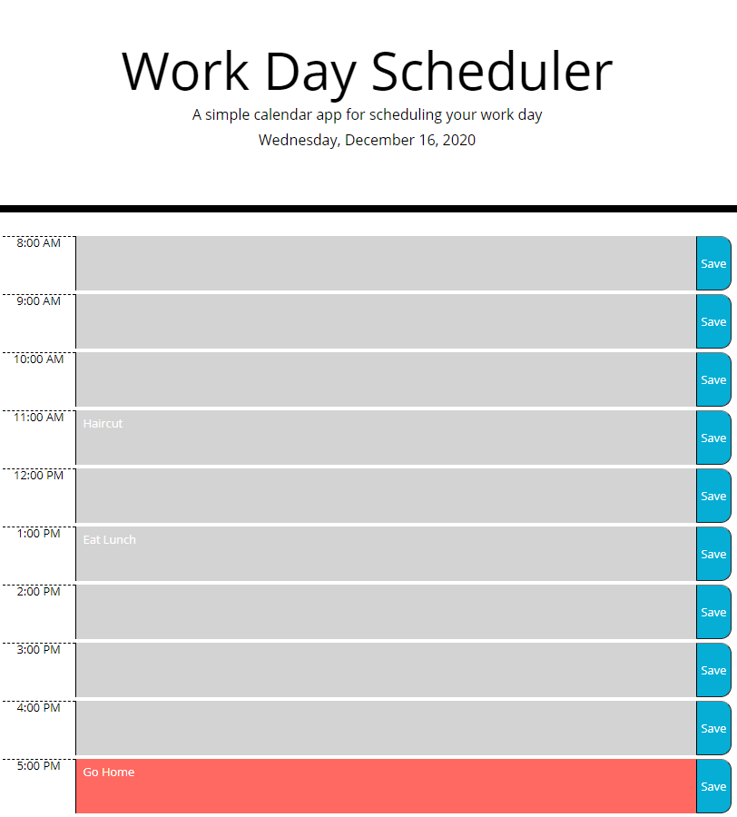

# Portfolio
Portfolio for Cameron Lundy to share with future employeers.

## Link to Site
https://lundyc0917.github.io/Portfolio/

## Motivation
Create a portfolio page where future employeers can view previous projects completed.

## Build Status
build | passing

## Screen Shot


## Framework

Built Using:
 - JavaScript
 - HTML
 - Bootstrap

## Features

An "About Me" section to give employeers a brief background.

A work section that displays screenshots, short descriptions, and links to previous projects and GitHub repositories.

A section that contains current contact information

## Code Example

```````````````````````````````
      <h2>Work</h2>
      <div class="vl">
        <!-- Portfolio Images -->
        <!-- Spotlight Image -->
        <div id="spotlight">
          <a id="link" href="https://lundyc0917.github.io/Password-Generator/">
            
          </a> 
          <div class="img-head">
            <h4>Password Generator</h4>
            <h5>Generate strong Passwords based on user critiera</h5>
            <a id="githubLinks" href="https://github.com/lundyc0917/Password-Generator">GitHub Link</a>
          </div>

        </div>

        <!-- Second Row -->
        <div id="row">
          <div  class="work-links">
            <a id="link" href="https://lundyc0917.github.io/Workday-Planner/">
              
            </a> 
            <div class="img-head">
              <h4>Workday Planner</h4>
              <h5>Planner for daily schedule</h5>
              <a id="githubLinks" href="https://github.com/lundyc0917/Workday-Planner">GitHub Link</a>
            </div>
          </div>
```````````````````````````````